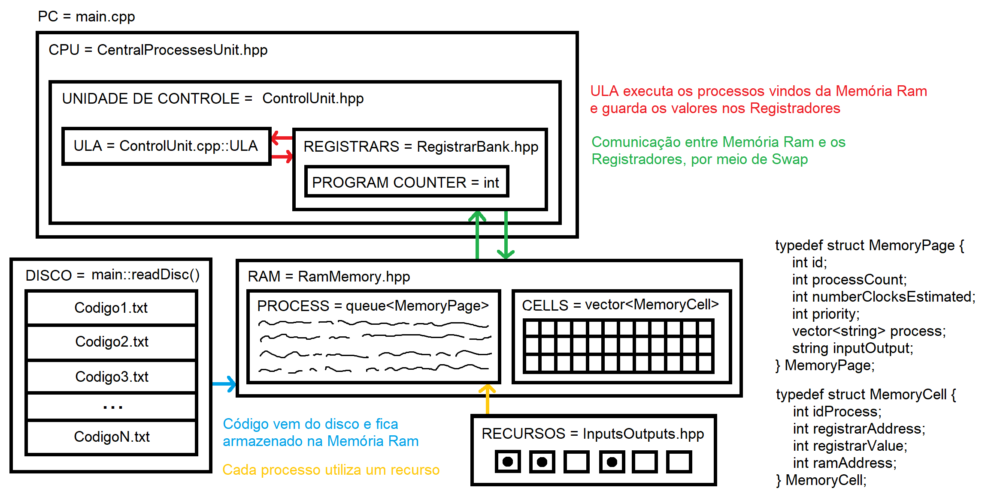

<section>   
    <h1>📢 SO: Simulador da Arquitetura de Von Neumann e Pipeline MIPS</h1>   
    

        Criado em Dezembro de 2024, o projeto do<strong> Simulador da Arquitetura de Von Neumann e Pipeline MIPS</strong> foi desenvolvido em virtude de atender as demandas do curso de Sistemas Operacionais, ministrado pelo professor <a href="https://www.linkedin.com/in/michelpiressilva/?originalSubdomain=br" target="_blank">Michel Pires Da Silva</a> no Centro Federal de Educação Tecnológica de Minas Gerais (<a href="https://www.divinopolis.cefetmg.br/" target="_blank">CEFET-MG</a>).
    

    

        <a href="https://github.com/LuanLuL/Sistemas_Operacionais/tree/master/documentation" target="_blank">Acesse os enunciados [AQUI]</a>
    

    

          

            Desenvolvido apenas por mim, <a href="https://www.linkedin.com/in/luan-santos-9bb01920b/" target="_blank">Luan Gonçalves Santos</a>, o projeto consiste em um simulador com arquitetura multicore e suporte a preempção que processa instruções MIPS através de pseudoparalelismo realizado por threads controladas pelo mutex; Sendo este desenvolvido na linguagem C++.
         
   
    

</section>

<section>
    <h2>📌Estrutura Geral</h2>
    

        O simulador é composto por classes que representam a <b>1) CPU</b>, a qual possui uma <b>2) Unidade de Controle</b>, a <b>3) Memória RAM</b>, um <b>4) Banco de Registradores</b> e a <b>5) Tabela de Recursos</b>. Além disso, o código principal executa as instruções a partir de arquivos TXTs que são abstraídos como sendo a <b>6) Memória ROM</b> da arquitetura. Com o intuito de organizar e proporcionar uma visão simplificada da comunicação entre essas estruturas do simulador, foi-se criado um desenho das classes e structs utilizadas no sistema, observe mais na Figura 1.  
    

     
    

        
          <strong>Figura 1:</strong> Desenho sobre o Simulador da Arquitetura de Von Neumann e Pipeline MIPS
    

    

        O simulador segue um fluxo básico de execução de instruções, semelhante ao ciclo de instruções de um processador com pipeline, com as fases de busca (fetch), decodificação (decode), execução (execute), acesso à memória (memory access), e escrita de volta (write back).
    

    

        <h3>1) CPU</h3>
        

            A classe CPU é responsável pelo controle do fluxo de instruções. Isso acontece a partir das seguintes funções:
        

        <ul>
            <li><code>CentralProcessesUnit::execute()</code>: Implementa a lógica de um escalonador com <i>time-sharing</i>, utilizando <i>time quantum</i> para dividir o tempo da CPU entre diferentes processos. A função carrega uma página de memória do processo na RAM (swapProgram), executa instruções enquanto o contador de programa (PC) estiver dentro do tamanho do processo e não exceder o tempo máximo (TIME_QUANTUM). Durante a execução, a unidade lógica aritmética (ULA) processa as instruções, os ciclos de clock são incrementados, e, se o limite de time quantum for atingido, o processo é suspenso e outro pode ser escalonado. Quando o processo termina, ou é preemptado, a página de memória é descarregada da RAM.</li>
            <li><code>CentralProcessesUnit::swapProgram()</code>: Esta função gerencia a troca de contextos entre processos em execução e a memória principal (RAM), essencial para o funcionamento de um simulador baseado na arquitetura de Von Neumann e no pipeline MIPS. Dependendo do tipo de troca especificado pela variável <i>typeOfSwap</i>, a CPU executa diferentes ações para lidar com o estado dos registradores e da memória.
                <ol type="I">
                    <li>
                        <strong>Tipo 0 - Processo finalizado:</strong> Neste caso, a função é responsável por limpar todos os recursos associados a um processo que terminou sua execução. Os registradores utilizados pelo processo são marcados como limpos, indicando que estão disponíveis para novos processos. Além disso, todas as células de memória na RAM associadas ao processo (identificadas pelo idProcess) são apagadas. Esse procedimento garante que nenhum dado residual permaneça na CPU ou na memória, evitando conflitos futuros. Por fim, a CPU é liberada, ficando pronta para receber outro processo.
                    </li>
                    <li>
                        <strong>Tipo 1 - Time Quantum expirado:</strong> Quando o tempo de time quantum de um processo termina, esta lógica salva o estado atual do processo para que ele possa ser retomado posteriormente. O valor do contador de programa (PC) é armazenado em uma <i>struct</i> do processo (MemoryPage) para registrar o ponto onde foi interrompido. Os valores dos registradores usados pelo processo são copiados para a memória RAM, preservando o estado atual do processo, por meio da <i>struct MemoryCell</i>, que representa uma célula de memória. Após o salvamento, os registradores são marcados como limpos e a CPU é liberada, permitindo que outro processo seja escalonado. Essa abordagem implementa o compartilhamento de recursos relacioando a memória principal (RAM), fundamental em sistemas multitarefa.
                    </li>
                    <li>
                        <strong>Tipo 2 - Novo processo entrando:</strong> Quando um novo processo é escalonado para execução, esta lógica inicializa o contexto necessário na CPU. O status da CPU é atualizado para ocupado, indicando que está em uso. O contador de programa (PC) é configurado para retomar a execução do processo no ponto onde ele foi interrompido anteriormente. Em seguida, os valores da memória RAM associados ao processo (registradores e valores) são carregados nos registradores da CPU, restaurando o estado do processo para continuar sua execução. Isso assegura a continuidade sem perda de dados ou inconsistências no processamento.
                    </li>
                </ol>
            Essa lógica de troca de contexto é essencial para gerenciar múltiplos processos em ambientes multitarefa, garantindo que os dados de cada processo sejam preservados e restaurados corretamente. Em caso de tipo de troca inválido, uma exceção é lançada para evitar comportamento inesperado.
            </li>
        </ul>
    

    

         <h3> 2) Unidade de Controle </h3>
        

            A classe RAM simula a memória do sistema, com um <i>array</i> padrão de 1024 <i>strucs</i> do tipo MemoryCell, onde cada posição pode ser lida ou escrita por meio de funções de acesso.
        

    

    <h3> 3) RAM </h3>
    

        A classe RAM simula a memória do sistema, com um array de 32 inteiros, onde cada posição pode ser lida ou escrita por meio de funções de acesso. O estado da RAM pode ser exibido na saída padrão. A classe também implementa mecanismos para gerenciar os processos vindos da Memória ROM, nesse sentido ele são armazenados na fila de processos, onde ficam aguardando seu momento de execução. Esse gerenciamento acontece a partir de algumas funções indispensáveis:
        <ul>
            <li>
                <code>RamMemory::RamMemory()</code>: O construtor da classe inicializa uma instância de memória RAM com um tamanho definido pelo parâmetro <i>size</i>. Sempre que o sistema inicializa, é verificado se o tamanho fornecido é maior que zero; caso contrário, lança uma exceção (invalid_argument) para garantir que a memória tenha uma capacidade válida. Em seguida, o construtor dimensiona o vetor memoryCells para comportar o número especificado de células de memória. Cada célula é inicializada com valores padrões zerados  Isso assegura que a RAM comece com todas as células devidamente alocadas e prontas para serem utilizadas, refletindo o estado inicial de uma memória limpa.
            </li>
            <li>
                <code>RamMemory::write()</code>: A função de escrita da classe é responsável por alocar uma célula de memória (MemoryCell) na RAM, seguindo diferentes tipos de operações definidos pelo parâmetro <i>kindOfWrite</i>. No caso 0 (operação STORE), escreve no endereço especificado se ele estiver vazio ou ocupado pelo mesmo processo. No caso 1, limpa o endereço, marcando-o como disponível após a finalização de um processo. No caso 2, realiza um swap de registradores sujos para o primeiro espaço livre na memória; se não houver espaço, lança uma exceção indicando que a memória está cheia. A função também valida o endereço fornecido, garantindo que ele esteja dentro do intervalo permitido, e lança exceções em caso de erro, como endereço fora do intervalo ou tipo de escrita inválido. Essa função é essencial para gerenciar a alocação e liberação de células de memória no simulador, evitando conflitos e garantindo eficiência no uso da RAM.
            </li>
        </ul>
    

    <h3>4) RegisterBank</h3>
    

        A classe RegisterBank simula o banco de registradores do processador, armazenando 32 registradores, cada um com um valor e um flag <em>dirty</em> que indica se o registrador foi alterado. Os registradores podem ser lidos e escritos por meio de funções de acesso.
    

    

        <h3>5) Recursos do Sistema</h3>
        

    

    

        <h3>6) Memória ROM</h3>
        

    

</section>
<section>
    <h2>📝 Instruções Definidas para a Memória ROM</h2>
    

        <h3> 1. LOAD</h3>
        <ul>
            <li>
                <strong>Formato</strong>: LOAD &lt;valor&gt; &lt;dest&gt;
            </li>
            <li>
                <strong>Descrição</strong>: Carrega um valor imediato no registrador &lt;dest&gt.
            </li>
            <li>
                <strong>Exemplo</strong>: LOAD 10 16 ➡ Carrega o valor <i>int(10)</i> no registrador 16.
            </li>
        </ul>
    

    

        <h3>2. ADD</h3>
        <ul>
            <li>
                <strong>Formato</strong>: ADD &lt;src1&gt; &lt;src2&gt; &lt;dest&gt;
            </li>
            <li>
                <strong>Descrição</strong>: Soma o valor dos registradores &lt;src1&gt; e &lt;src2&gt; e armazena o resultado em &lt;dest&gt;.
            </li>
            <li>
                <strong>Exemplo</strong>: ADD 18 16 17 ➡ Soma o valor dos registradores 18 e 16 para armazenar o resultado no registrador 17.
            </li>
        </ul>
    

    

        <h3>3. SUB</h3>
        <ul>
            <li>
                <strong>Formato</strong>: SUB &lt;src1&gt; &lt;src2&gt; &lt;dest&gt;
            </li>
            <li>
                <strong>Descrição</strong>: Subtrai o valor em &lt;src2&gt; do valor em &lt;src1&gt; e armazena o resultado em &lt;dest&gt;.
            </li>
            <li>
                <strong>Exemplo</strong>: SUB 16 17 18 ➡ Subtrai o valor no registrador 17 do valor no registrador 16 e armazena o resultado em 18.
            </li>
        </ul>
    

    

        <h3>4. STORE</h3>
        <ul>
            <li>
                <strong>Formato</strong>: STORE &lt;src&gt; &lt;endereco&gt;
            </li>
            <li>
                <strong>Descrição</strong>: Armazena o valor do registrador &lt;src&gt; na posição de memória &lt;endereco&gt;.
            </li>
            <li>
                <strong>Exemplo</strong>: STORE 18 16 ➡ Armazena o valor do registrador 18 na posição de memória 16, se possível; Caso não, o processo entrará em estado de inanição.
            </li>
        </ul>
    

    

        <h3>5. IF</h3>
        <ul>
            <li>
                <strong>Formato</strong>: IF &lt;operation&gt; &lt;src1&gt; &lt;src2&gt; &lt;dest&gt;
            </li>
            <li>
                <strong>Descrição</strong>: Executa uma comparação entre os valores dos registradores &lt;src1&gt; e &lt;src2&gt;, com base na operação &lt;operation&gt; (&lt; ou &gt;). O resultado da comparação ( 6666 para verdadeiro, -6666 para falso) é armazenado no registrador &lt;dest&gt;.
            </li>
            <li>
                <strong>Exemplo</strong>: IF &gt; 10 20 30 ➡ Compara se o valor no registrador 10 é maior que o valor no registrador 20. O resultado (6666 ou -6666) será armazenado no registrador 30.
            </li>
        </ul>
    

    

        <h3>6. FOR</h3>
        <ul>
            <li>
                <strong>Formato</strong>: FOR &lt;operation&gt; &lt;times&gt; &lt;value&gt; &lt;dest&gt;
            </li>
            <li>
                <strong>Descrição</strong>: Realiza uma operação repetida (SUB ou ADD) um número de vezes especificado em &lt;times&gt;, usando o &lt;value&gt; como operando, e armazena o resultado acumulado no registrador &lt;dest&gt;.
            </li>
            <li>
                <strong>Exemplo</strong>: FOR ADD 5000 10 15 ➡ Realiza a operação de adição, somando o valor <i>int(10)</i> ao registrador 15 repetidamente por 5000 vezes.
            </li>
        </ul>
    

</section>
<section>
    <h2>⚙️Como executar o simulador </h2>
    

        O projeto possui um arquivo Makefile que realiza todo o procedimento de compilação e execução. Para tanto, temos as seguintes diretrizes de execução para distribuições Linux:
    

    

        <table>
            <thead>
                <tr>
                    <th>Comando</th>
                    <th>Função</th>
                </tr>
            </thead>
            <tbody>
                <tr>
                    <td><code>make clean</code></td>
                    <td>Apaga a última compilação realizada contida na pasta build</td>
                </tr>
                <tr>
                    <td><code>make</code></td>
                    <td>Executa a compilação do programa utilizando o gcc, e o resultado vai para a pasta build</td>
                </tr>
                <tr>
                    <td><code>make run</code></td>
                    <td>Executa o programa da pasta build após a realização da compilação</td>
                </tr>
            </tbody>
        </table>
        

            <b>Tabela 1:</b> Comandos úteis para compilar e executar o programa de computador
        

    

</section>
<section>
    <h2>💻 Ferramentas Utilizadas</h2>
    

        Durante o deselvovimento do algoritimo apresentado nesse repositório, foi-se utilizado de duas principais ferramentas de desenvolvimento: Visual Studio Code e WSL: Ubuntu.
    

    <ul>
        <li>    
            

                O Visual Studio Code é um editor de texto multiplataforma disponibilizado pela Microsoft para o desenvolvimento de aplicações, Conhecer essa ferramenta é importante para os desenvolvedores que pretendem trabalhar em ambientes multiplataforma, por exemplo,  podendo operar o desenvolvimento em ambiente Mac e Linux, ao mesmo tempo em que mantém o projeto compatível com Windows. Segue em anexo o link para o site da plataforma — <a href="https://code.visualstudio.com/" target="_blank">Visual Studio Code</a>.
            

        </li>
        <li>
            

                O WSL é um método para se executar comandos Linux dentro do Windows de forma simplificada. Essa platoforma se torna essencial para o desenvovimento, evitando tarefas como a intalação de máquinas vituais e a criação de dual booting no computador pessoal. Nesse projeto, o WSL foi utilizado para compilar e executar o programa em C++ em um ambiente Linux através do Windows. Segue em anexo um  tutorial de download do WSL2 — <a href="https://youtu.be/hd6lxt5iVsg" target="_blank">Tutorial WSL2</a>.
            

        </li>
    </ul>
</section>
<section>
    <h2>📚 Referências</h2>
    

        BERTINI, Luciano. <strong>Capítulo 5 Pipeline</strong>. 2019. Disponível em: <a href="https://www.professores.uff.br/lbertini/wp-content/uploads/sites/108/2017/08/Cap-5-Pipeline.pdf">https://www.professores.uff.br/lbertini/wp-content/uploads/sites/108/2017/08/Cap-5-Pipeline.pdf</a>. Acesso em: 24 out. 2024.
    

</section>

